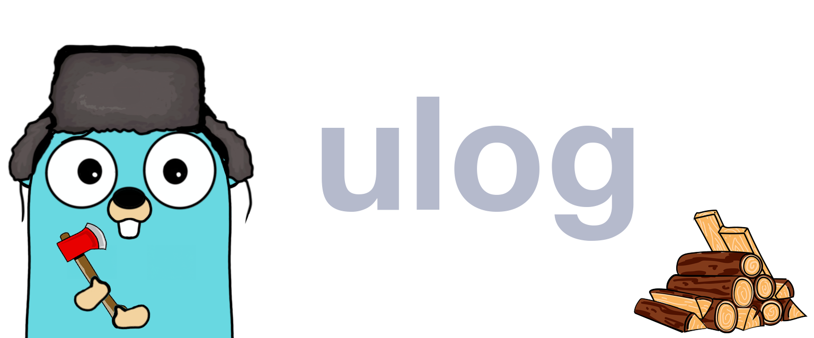

<div align="center" style="margin-bottom:20px">
  <!--  -->
  <div align="center">
    <a href="https://github.com/blugnu/ulog/actions/workflows/pipeline.yml"></a>
    <a href="https://goreportcard.com/report/github.com/blugnu/ulog" ></a>
    <a>= 1.14" src="https://img.shields.io/github/go-mod/go-version/blugnu/ulog?style=flat-square"/></a>
    <a href="https://github.com/blugnu/ulog/blob/master/LICENSE"></a>
    <a href="https://coveralls.io/github/blugnu/ulog?branch=master"></a>
    <a href="https://pkg.go.dev/github.com/blugnu/ulog"></a>
  </div>
</div>

<br>

# blugnu/ulog

A highly configurable, structured logging library for Go that does not sacrifice (too much) efficiency in exchange for convenience and flexibility.

## Features

* **Highly configurable** - configure your logger to emit logs in the format you want, with the fields you want, at the level you want, sending them to the destination (or destination**s**) you want; the default configuration is designed to be sensible and useful out-of-the-box, but can be easily customised to suit your needs

* **Structured logging** - logs are emitted in a structured format (`logfmt` by default) that can be easily parsed by log aggregators and other tools; a JSON formatter is also provided 

* **Contextual logging** - logs may be enriched with context from the current goroutine's context, from context provided by the caller or from context carried by an error (via support for the [blugnu/errorcontext](https://github.com/blugnu/errorcontext) module); automatic contextual enrichment can be embedded by registering a `ulog.ContextEnricher` with the logger

* **Efficient** - allocations are kept to a minimum and conditional flows eliminated where-ever possible to ensure that the overhead of logging is kept to a minimum

* **Flexible** - support for multiple logging backends via adapters, with support for custom adapters

* **Convenient** - a simple, consistent and familiar API that is easy and intuitive to use

* **Testable** - the `ulog.Logger` interface is easy to mock and test with a configurable log mock that can be used to verify that correct logs are emitted by your code; build log expectations into a TDD workflow!

* **Extendable** - extend the reach of your logging into modules shared by your projects, providing automatic context enrichment and consistent logging across your codebase; other `blugnu` modules either already have built-in support for `ulog` or will be extended to support it

## Installation

```bash
go get github.com/blugnu/ulog
```

## Usage

A minimal example of using `ulog` to produce a `logfmt` formatted message to `os.Stdout`:

```go
package main

func main() {
    // create a new logger
    logger := ulog.New()

    // log a message
    logger.Info("hello world")
    logger.Error("oops!")
}
```
Will produce output similar to the following:

```bash
time=2023-11-23T12:35:04.789346Z level=INFO  msg="hello world"
time=2023-11-23T12:35:04.789347Z level=ERROR msg="oops!"
```

For more detailed examples, see the [examples](examples) directory.

## Configuration

The default configuration is designed to be sensible and useful out-of-the-box, but can be easily customised to suit your needs.

### Levels

The following log levels are supported:

* `TRACE` - for low-level diagnostic purposes
* `DEBUG` - for debugging purposes
* `INFO` - for informational messages
* `WARN` - for warning messages
* `ERROR` - for error messages
* `FATAL` - for fatal errors

The default log level is `INFO` which may be overridden via the `LoggerLevel` configuration function when configuring a new logger:

```go
logger := ulog.New(ulog.LoggerLevel(ulog.DEBUG))
```

### Formatter

The following formatters are supported:

* `logfmt` - a simple, structured format that is easy for humans and machines to read and parse
* `json` - a structured format that is easy for machines to parse

The default formatter is `logfmt` but may be overridden using the `LoggerFormat` configuration function when configuring a new logger:

```go
logger := ulog.New(ulog.LoggerFormat(ulog.NewJSONFormatter()))
```

Formatters typically offer a number of configuration options that can be set via the configuration functions supplied to their `New` function.  For example, to configure the label used for the timestamp field in the `logfmt` formatter:

```go
logger := ulog.New(
  ulog.LoggerFormat(
    ulog.NewLogfmtFormatter(
      ulog.SetTimestampLabel("ts"),
      ),
    ),
  )
```

### Output

On a standard logger, the output may be written to any `io.Writer`.  The default output is `os.Stdout`.

The output may be configured  via the `LoggerOutput` configuration function when configuring a new logger:

```go
logger := ulog.New(ulog.LoggerOutput(io.Stderr))
```

Logs may be sent to _multiple_ outputs by using the `ulog.Mux` backend.  See the [examples](examples) directory for more details.

### Call-site logging

If desired, the logger may be configured to emit the file name and line number of the call-site that generated the log message.  This is disabled by default.

Call-site logging may be enabled via the `LogCallSite` configuration function when configuring a new logger:

```go
logger := ulog.New(ulog.LogCallSite(true))
```

The labels used for call site logging may be configured via the `CallSiteLabels` configuration function when configuring a new logger:

```go
logger := ulog.New(ulog.CallSiteLabels(map[ulog.FieldLabel]string{
  ulog.FileLabel: "file",
  ulog.FunctionLabel: "line",
}))
```
